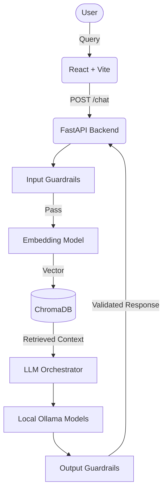

# 🏛️ BMU University RAG & AI Orchestration Platform


A production-ready Retrieval-Augmented Generation (RAG) system tailored for BML Munjal University. This platform serves as a highly reliable, locally hosted AI assistant capable of answering questions about university policies, fee structures, and attendance requirements without hallucinating.

Beyond a simple chatbot, this project exposes the **entire RAG orchestration layer** visually, functioning as a comprehensive educational and evaluation platform for Large Language Models (LLMs).

---

## ✨ Key Features

### 1. Robust Retrieval-Augmented Generation
- **Local AI Engine:** Uses local Ollama inference (`starcoder2:3b`, `qwen2.5-coder:1.5b`) to ensure data privacy.
- **Vector Search:** Powered by local ChromaDB and `all-MiniLM-L6-v2` embeddings for fast, semantic retrieval.
- **Traceability:** Every answer guarantees a specific `[SOURCE X]` citation linked to the original university document.

### 2. Comprehensive Security & Guardrails
A strict pipeline ensures the AI remains safe, focused, and reliable:
- **Input Guards:**
  - `ScopeGuard`: Blocks out-of-domain questions (e.g., general knowledge) keeping the model strictly on university topics.
  - `PIIGuard`: Detects and blocks sensitive personal data (Aadhaar, PAN, phone numbers).
  - `ContentGuard`: Filters inappropriate language.
  - `InputLengthGuard`: Prevents context window overload and prompt injection attacks.
- **Output Guards:**
  - `ContextGroundingGuard`: Uses semantic similarity to ensure the LLM's response is strictly grounded in the retrieved context.
  - `RefusalConsistencyGuard`: Forces the model to refuse to answer when context is missing, eliminating hallucination.
  - `SourceCitationGuard`: Validates the presence of correct document citations.

### 3. Multi-Model Evaluation & LLM-as-a-Judge
- Automated parallel runner evaluates multiple LLMs side-by-side across 7 distinct categories (Explanation, Refactoring, RAG Questions, etc.).
- Replaces naive heuristics with an **LLM-as-a-judge** methodology to score Responses on Accuracy, Completeness, and Grounding, supplemented by sentence-transformer Semantic Similarity.
- Auto-generates detailed markdown reports and visualizations on the frontend.

### 4. Interactive Visual Dashboards
- **RAG Pipeline Visualization:** Watch queries turn into vectors, match against chunks, and synthesize into answers.
- **Guardrails Dashboard:** A live tester and visual test-runner for the 22+ active safety guards.
- **Knowledge Base Inspector:** Direct visual access to the parsed document chunks and 384-dimensional vector embeddings.

---

## 🏗️ Architecture



---

## 🚀 Getting Started

### Prerequisites
- Node.js (v18+)
- Python 3.10+
- [Ollama](https://ollama.ai/) installed locally and running.

### 1. Backend Setup
```bash
# Clone the repository
git clone https://github.com/yourusername/university-rag.git
cd university-rag

# Install Python dependencies
pip install -r requirements.txt

# Start the FastAPI server (runs on port 8000)
PYTHONPATH=. uvicorn api.main:app --host 0.0.0.0 --port 8000
```

### 2. Frontend Setup
```bash
# Open a new terminal instance
cd frontend

# Install Node dependencies
npm install

# Start the Vite development server
npm run dev
```
Navigate to `http://localhost:5173` in your browser.

---

## 🧪 Testing & Validation

The project uses a rigorous output testing methodology via `pytest`.

To run the AI Output Quality suite (tests Relevance, Grounding, Hallucination, Formatting, and Answerability):
```bash
python3 -m pytest tests/test_output_quality.py -v
```
*Note: Test results are also fully exposed in the "Guardrails" tab of the web frontend.*

## 📊 Evaluation Runner
To run a batch evaluation of your configured LLMs:
```bash
python3 -m evaluation.runner_parallel
```
This automatically tests 70+ prompts across models, invokes the LLM Judge, and generates a `WEEK4_CATEGORY_REPORT.md` file with the categorical winners.

---

## 📄 License
This project is licensed under the MIT License.
